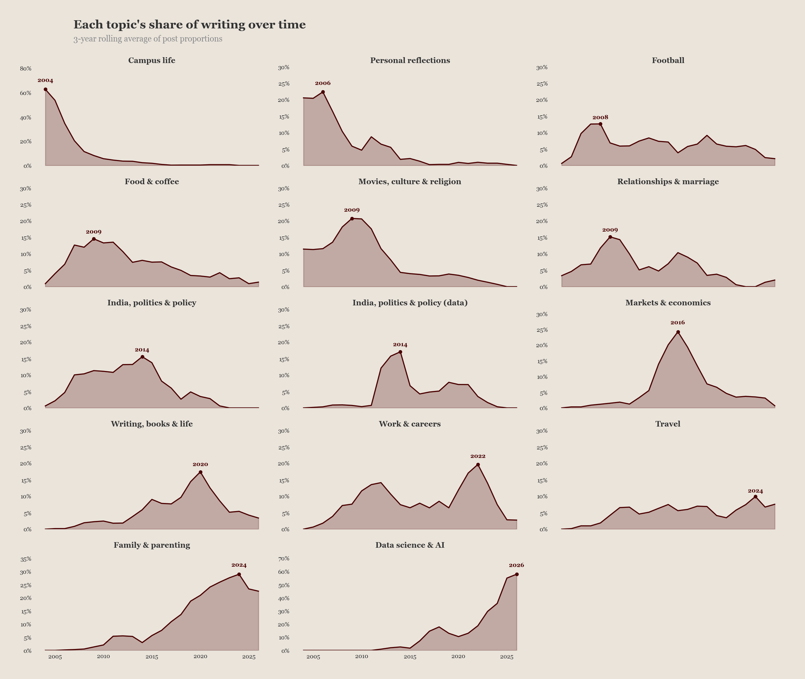
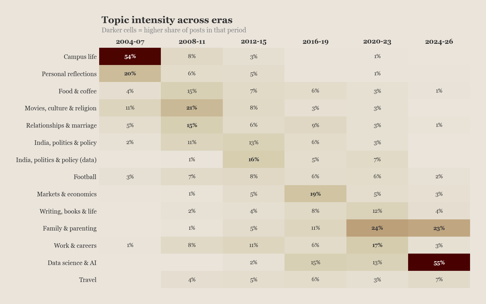
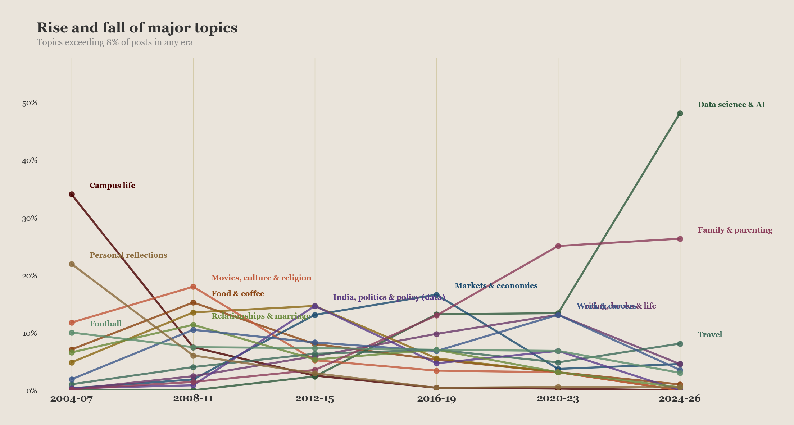
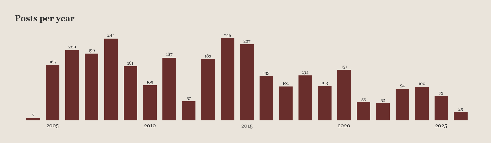

# I pointed an embedding model at 3,000 of my blog posts

A few weeks ago, I came across S. Anand's post about building an [embeddings map of his blog](https://www.s-anand.net/blog/blog-embeddings-map/). The idea was simple - take all your blog posts, generate vector embeddings using an LLM, and see what patterns emerge. I've been blogging since 2004, across WordPress and two Substacks, and I had about 3,000 posts sitting there. It felt like a good time to point a mirror at two decades of writing.

I adapted Anand's code to work with my WordPress XML export and Substack CSV dumps, ran everything through Gemini's embedding model, and let a clustering algorithm tell me what I've actually been writing about. Not the categories I assigned to posts (which were mostly "arbit" and "general" - very helpful, past me). What the text itself reveals.

## Fifteen topics, apparently

The algorithm settled on 15 clusters. Some were obvious - cricket, Liverpool FC, food and coffee, campus life from IIT and IIMB. Others surprised me. There's a distinct cluster for "personal reflections" that peaked in 2005 and has been declining ever since - those early posts where I was just processing life, writing things like "hassled..." and "I gave up" as titles. The earnestness of a 22-year-old who has just discovered that blogging is cheaper than therapy.

What I found more interesting than the clusters themselves is how they've shifted over time.

## The campus life cliff

The most dramatic shape in the data is campus life - it starts at nearly 50% of everything I wrote in 2004-05, and falls off a cliff by 2008. This makes sense. I was at IIMB, and my blog was essentially a diary of quizzing, classes, placements, and the general absurdity of being on campus. Once you graduate, you stop writing about campus. Obvious in retrospect, but there it is in the data - a sharp peak and a permanent decline.

Personal reflections follows a similar trajectory. That cluster of angsty, introspective posts - about feeling stuck, about relationships, about figuring out life - peaked in 2005-06 and has been steadily fading. I'm not sure if I've actually become less introspective or if I've just found other containers for it.

## The analytical turn

Something interesting happens around 2008-2012. The blog stops being a diary and starts becoming a column. India, politics, and policy shows up as a major theme for the first time, peaking around 2013-14 with posts about agriculture, the rupee, elections. This is around when I started writing for Mint, and you can see the blog absorbing that analytical energy.

Markets and economics follows right behind, peaking around 2015-16. Uber's surge pricing, market design, transaction costs. This is when I was working through ideas that eventually became my book. The blog was functioning as a notebook for economic thinking - posts about two-sided markets and pricing theory that I'd later refine into chapters.

The heatmap tells this story cleanly. The top-left is dark - campus life and personal reflections dominating the early years. Then there's a diagonal shift downward and rightward as new topics take over.

## The parenting bump

Family and parenting is absent until 2009, then grows steadily, peaking around 2016. My daughter was born in 2012, and the "Letters To My Berry" series ran for years. What's interesting is that this cluster doesn't just capture the parenting posts - it also picks up posts about kids' birthday parties, school systems, and the general domesticity that takes over your life in your thirties.

## Data science eats everything

The most striking trend is the recent explosion of data science and AI content. It barely registers before 2016, starts growing steadily, and by 2024-26 it accounts for nearly half of everything I write. Almost half. The "Art of Data Science" Substack, the posts about vibe coding and LLMs and Claude Code - this cluster has essentially consumed my writing output.

Look at the trajectory chart. Campus life starts high on the left and disappears. Data science and AI starts invisible and rockets upward on the right. It's almost a perfect mirror image - the two defining obsessions of my blogging life, bookending twenty years.

## The things that persist

Not everything follows a neat rise-and-fall arc. Food and coffee shows up consistently from about 2008 onward - never dominant, always present. Writing about Bangalore's coffee culture and restaurant scene seems to be a constant in my life regardless of whatever else I'm obsessing about.

Cricket and football (specifically Liverpool FC) are similar - they ebb and flow but never fully disappear. Cricket peaks in 2007-08, dips, and keeps ticking along. Liverpool shows up when I started following them around 2011 and has stayed at a low but steady hum since.

## What the model gets wrong

It's worth noting what the embeddings miss. The algorithm doesn't understand that my post about arranged marriages and my post about labour markets are, in my head, the same post. I've always written about relationships through the lens of economics - matching markets, search costs, information asymmetry. The clustering puts these in separate buckets because the vocabulary differs, even though the intellectual project is the same.

Similarly, the "travel" cluster picks up my Singapore notes and Dubai notes, but when I write analytically about cities and transport, that goes into "urban life". These are connected topics in my mind - I write about Bangalore's buses and about cities I visit through the same lens of urban observation. The model sees different words and separates them.

## The volume question

One thing the analysis doesn't capture is that I've been writing less over time. My peak years were 2008 and 2014, both around 245 posts. There's a dramatic crash in 2012 - down to 57 posts - which I know was a difficult personal period. Since 2016, I've been averaging about 100 posts a year, roughly half my earlier output.

So when I say data science is 50% of my recent writing, that's 50% of a smaller pie. In absolute terms, I wrote more about Indian politics in 2013-14 than I'm writing about AI now. The concentration has increased even as the volume has decreased.

## What this actually tells me

Twenty-two years of blogging, compressed into a set of scatter plots and heatmaps. The narrative is roughly: campus kid discovers he likes writing (2004-07), becomes an analytical blogger and newspaper columnist (2008-15), has kids and writes about everything from surge pricing to birthday parties (2015-20), and then gets consumed by AI and data science (2021-present).

The part I find most interesting is the gradual disappearance of the purely personal. Those early posts - the ones the algorithm labels "personal reflections" - were me working through confusion in real time. I don't write those anymore. I write about data science or markets or food. The introspection hasn't stopped, I think - it's just migrated into the analytical posts, where it shows up as a parenthetical aside rather than the main event.

If you want to explore the data or run this on your own blog, the code is at [github.com/skthewimp/blog-embeddings](https://github.com/skthewimp/blog-embeddings). And if you're curious about the 3,000 posts themselves, most of them are at [noenthuda.com](https://www.noenthuda.com).
